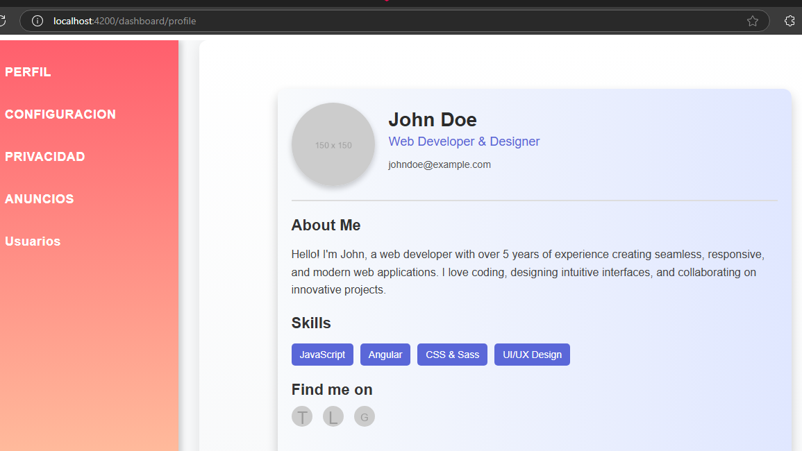
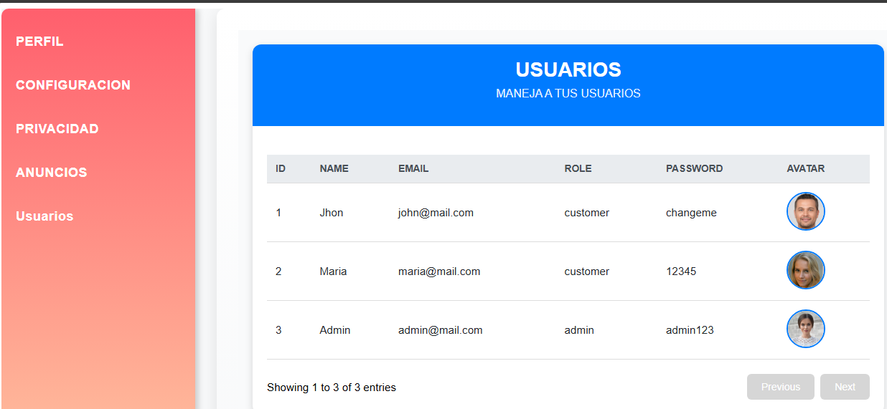

# Proyecto Angular: Gestión de Usuarios
Este proyecto es una aplicación desarrollada en Angular que incluye un sistema de autenticación básico y un panel de control. A través de este panel, el usuario puede acceder a diferentes secciones como Perfil, Configuración, Privacidad, Anuncios, y Usuarios. La funcionalidad principal es la visualización y gestión de usuarios utilizando datos obtenidos desde una API.

# CONDICIONES BASE
-----------------
1. Login Básico

Archivo: login.component.ts
La pantalla de inicio solicita un nombre de usuario y contraseña:

Usuario: admin

Contraseña: 1234

Si las credenciales son correctas, redirige al Dashboard.
Si las credenciales son incorrectas, muestra un mensaje de error: "Usuario o contraseña incorrectos."

2. Dashboard
Archivo: dashboard.component.ts

Actúa como el núcleo de navegación.
Contiene un menú con las siguientes opciones:

Perfil: Redirige a /dashboard/profile.

Configuración: Redirige a /dashboard/settings.

Privacidad: Redirige a /dashboard/privacy.

Anuncios: Redirige a /dashboard/ads.

Usuarios: Redirige a /dashboard/users y muestra la tabla de usuarios.

# Estructura del Proyecto
LoginComponent
Permite a los usuarios autenticarse.

DashboardComponent
Es el panel principal que contiene un menú con diversas secciones, como perfil, configuración y gestión de usuarios.

UsersComponent
Muestra la lista de usuarios obtenidos de una API REST, permitiendo navegar entre páginas de datos.

UserService
Gestiona las interacciones con la API para obtener los datos de los usuarios.

# Explicación Detallada de los Componentes
1. UserService:

El UserService es un servicio de Angular que utiliza el módulo HttpClient para interactuar con la API REST.
Está configurado como un servicio global (providedIn: 'root') para que pueda ser utilizado en cualquier parte de la aplicación.

Ubicación: src/app/services/user.service.ts

@Injectable({
  providedIn: 'root'
})
export class UserService {
  private apiUrl = 'https://api.escuelajs.co/api/v1/users';

  constructor(private http: HttpClient) {}

  getUsers(): Observable<User[]> {
    return this.http.get<User[]>(this.apiUrl);
  }
}

Cómo Funciona 

Propiedad apiUrl:

Define la URL base de la API para obtener los datos de usuarios.

Método getUsers:

Realiza una solicitud HTTP GET a la URL definida.

Retorna un Observable que emite un arreglo de objetos User (basados en la interfaz User).

Uso del Servicio en el Componente:

El servicio es inyectado en los componentes mediante el constructor. Los datos se obtienen llamando al método getUsers y suscribiéndose a su resultado.

2. UsersComponent

El UsersComponent es un componente de tipo standalone que muestra los usuarios obtenidos desde la API en una tabla interactiva con paginación y un indicador de carga.

Ubicación: src/app/components/users.component.ts

Funcionamiento Interno
--------------------
Propiedades:

users: Contiene todos los usuarios obtenidos desde la API.

displayedUsers: Contiene solo los usuarios visibles en la página actual.

loading: Controla si se muestra el indicador de carga.

currentPage y pageSize: Manejan la lógica de paginación.

Métodos:

loadUsers:

Llama al servicio UserService para obtener los usuarios.
Suscribe a la respuesta de la API y actualiza users y displayedUsers.

updateDisplayedUsers:
Calcula el rango de usuarios visibles en función de la página actual y actualiza displayedUsers.

nextPage y previousPage:
Cambian la página actual y actualizan los usuarios visibles.

trackByUserId:
Optimiza el rendimiento al reutilizar elementos de la tabla basada en el id del usuario.

Ciclo de Vida:
En el método ngOnInit, se llama a loadUsers para cargar los datos al inicializar el componente.

La plantilla utiliza *ngIf para mostrar un indicador de carga o los datos una vez que están disponibles. Además, incluye una tabla con usuarios y botones de paginación.

html estos son algunos datos que continene la tabla de usuarios son mas en la API pero pues con esos son los mas indispensables

                <th>ID</th>

                <th>Name</th>

                <th>Email</th>

                <th>Role</th>

                <th>Password</th>

                <th>Avatar</th>
          
   
# PRUEBAS DE ESCRITORIO

La lista de los usuarios se puede obtener mediante la API, pero para fines de este ejemplo, se utilizarán los siguientes por que pueden cambiar sin previo aviso

Una vez adentro podemos observar nuestro dashbard que hace referencia a la siguiente imagen:

Para comprobar que estamos haciendo buen eso de la api podemos verla a traves de la tabla que muestra los datos de los usuarios que se encuentran en la siguiente imagen:

